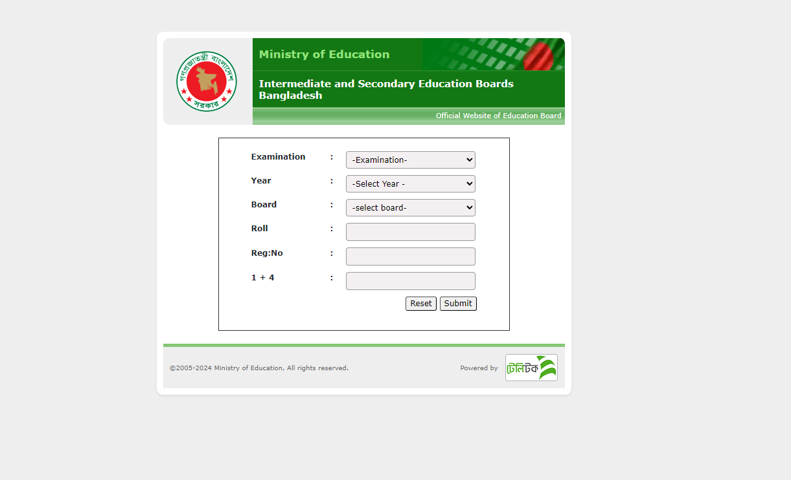

# Board Result System: A Modern Approach to Result Management 👨‍🎓

## Project Overview 💡
Welcome to the **Board Result System**! This project is a streamlined, interactive clone of our country's official SSC/HSC result portal. It's designed to showcase a modern approach to managing and displaying student results using **local browser storage**. We've created a dynamic system that allows you to add, edit, and delete mock student data, then search for and view a complete result sheet.

Since there's no real student data involved, the system uses **locally stored mock data**, giving you a safe environment to explore its functionalities. This means you have full control!

***Before you search for a result, remember to create student data first!***

---

## Features
- Create and store student data in local storage  
- Edit, update, and delete student data  
- Search for student results  
- Displays full result sheet if data matches  
- Shows alert if no matching data is found  

## Live Demo
[**View Live Project**](https://ziaul-hoque4820.github.io/board-result-system/)

## Video Demo
Watch the project demo video below: 
[](https://streamable.com/karp16)

## Getting Started

### Prerequisites
- A modern web browser (Chrome, Firefox, Edge, etc.)
- Local server (optional, only if required)

### Installation & Usage
1. **Clone the repository:**
   ```bash
   git clone https://github.com/ziaul-hoque4820/board-result-system.git
   ```
2. **Navigate to the project folder:**
   ```bash
   cd board-result-system
   ```
3. **Open the project:**
- Simply open index.html in your browser, or use a local server.
4. **Start using:**
- Add or manage student data using the admin section.
- Search for a result using the search form.
- If data matches, the full result sheet will be displayed.
- If not, an alert will appear: "Data not matched".

### Future Improvements
- Integration with a real database (Node.js or PHP + MySQL)
- User authentication (Login/Register system)
- Improved responsive design
- API-based real-time data fetching

### Contribution
- Contributions are welcome!
If you find any issues, bugs, or have suggestions for improvements, feel free to open an Issue or submit a Pull Request.

## 👨‍💻 Author

**Ziaul Hoque Patwary**  
📧 Email: [**ziaul.dev@gmail.com**] 
🔗 GitHub: [ziaul-hoque4820](https://github.com/ziaul-hoque4820)

---

**Thanks for visiting the project! Feel free to star ⭐ the repo or contribute.**